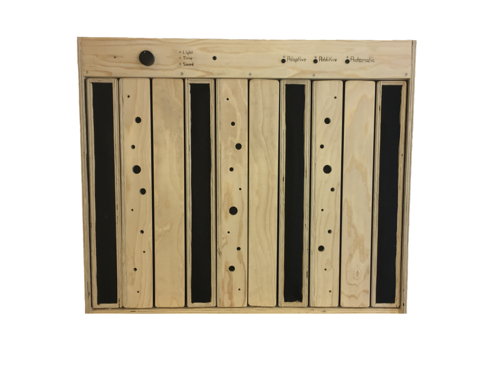
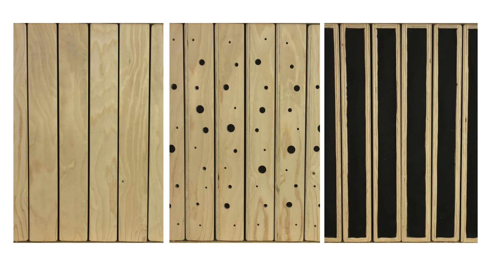
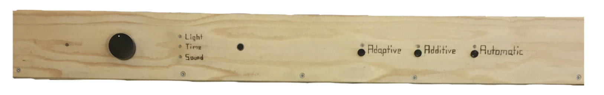
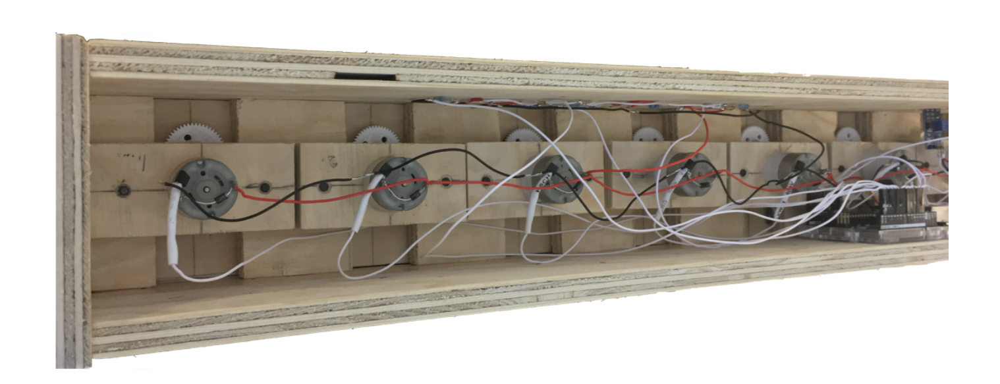

# Dynacoustic

This paper seeks to present and explore the possibilities that emerges by treating the acoustics of indoor spaces with a dynamic approach. The main argument is that acoustics not only can be used as a tool to reduce noise-levels and increase speech intelligibility, but that it also can be used actively and creatively to shape and strengthen the human experience in indoor spaces.

Throughout the paper this argument is defined by explaining how sound behaves in enclosed spaces, by presenting historical examples of the human ability to use acoustic phenomena to define or shape human experiences, by drawing upon the phenomenological understanding of the experience of spaces and by explaining the common methods of acoustical treatment.

Furthermore, this paper presents the dynamic acoustic approach as an opposition to the common acoustical practice – which is referred to as the static acoustic approach. The dynamic acoustic approach makes use of adaptive, additive, and automatic acoustic treatment methods to adjust the acoustics of a room to different kinds of activities. Since the level of human activity is dynamic these methods try to alter the room acoustics relatively to the dynamics of the human activity.

The adaptive acoustic method makes use of a gradual change from a reflective to an absorptive surface, whilst the additive acoustic methods is based on adding artificial reverb to an indoor space. The automatic acoustic method makes use of the forementioned techniques to alter room acoustics but aims to automate the control of these – linking the change in acoustic character to a controlling parameter.

A prototype of an artwork is included in this paper. This artwork seeks to materialize the characteristics of the dynamic acoustic approach through an acoustic panel. This panel allows users to experience and explore the adaptive, additive, and automatic acoustic methods. The panel makes use of rotatable prisms to change the amount of sound-absorption, lets users add artificial reverb to an input signal, and allows the prisms to rotate relatively to time, to the amount of light and sound in a room.

Lastly this paper seeks to discuss the need for and the potential of the dynamic acoustic approach in a world in which acoustics mostly are used to reduce noise-levels. The aural state of this world and the definition of noise is presented to enlighten this discussion, while the question of human controllability is included to the create basis for reflections upon how this dynamic approach could be used to improve the human experience of and in room acoustics.

[See a demonstration of the prototype in use here.](https://www.thomaseg.dk/)

## Design prototype

## Levels of acoustic absorption

## Interface

## Motors and electronic circuit

